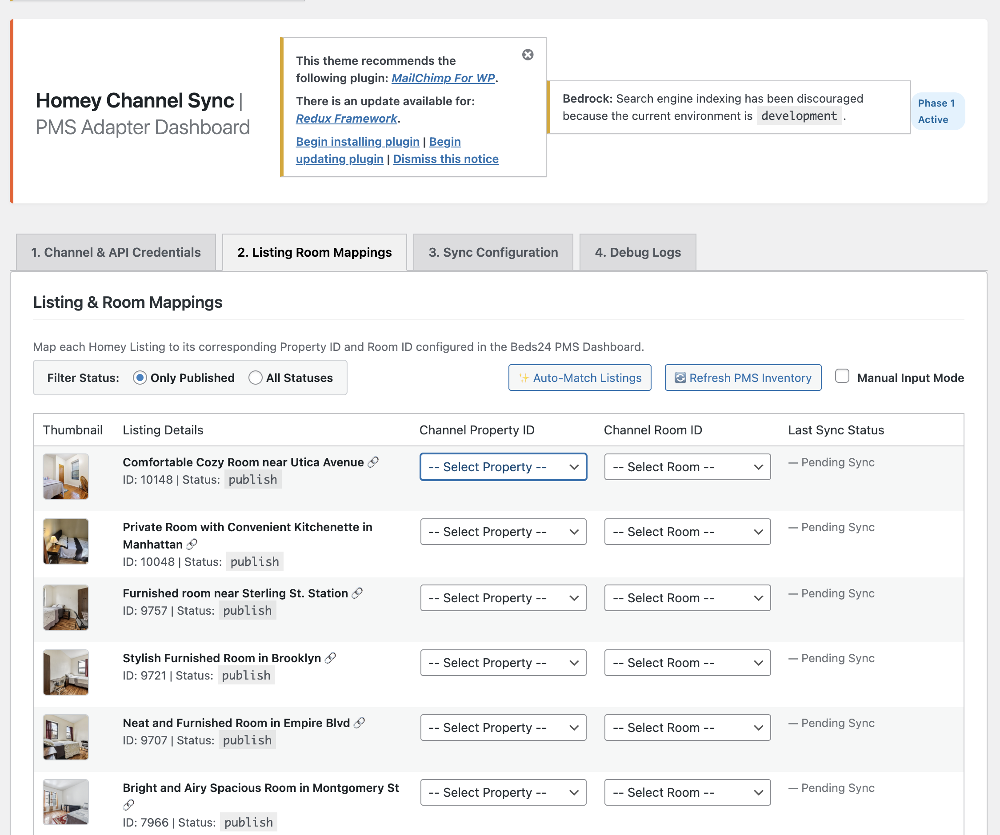
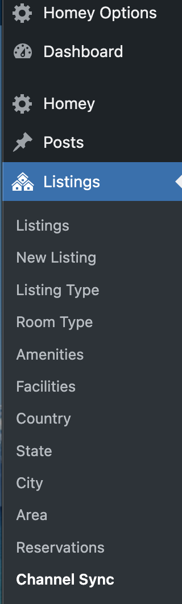
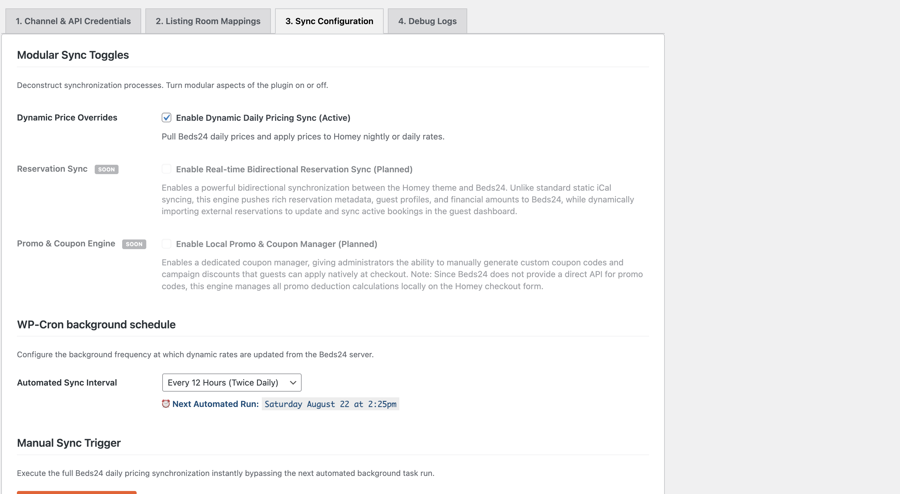
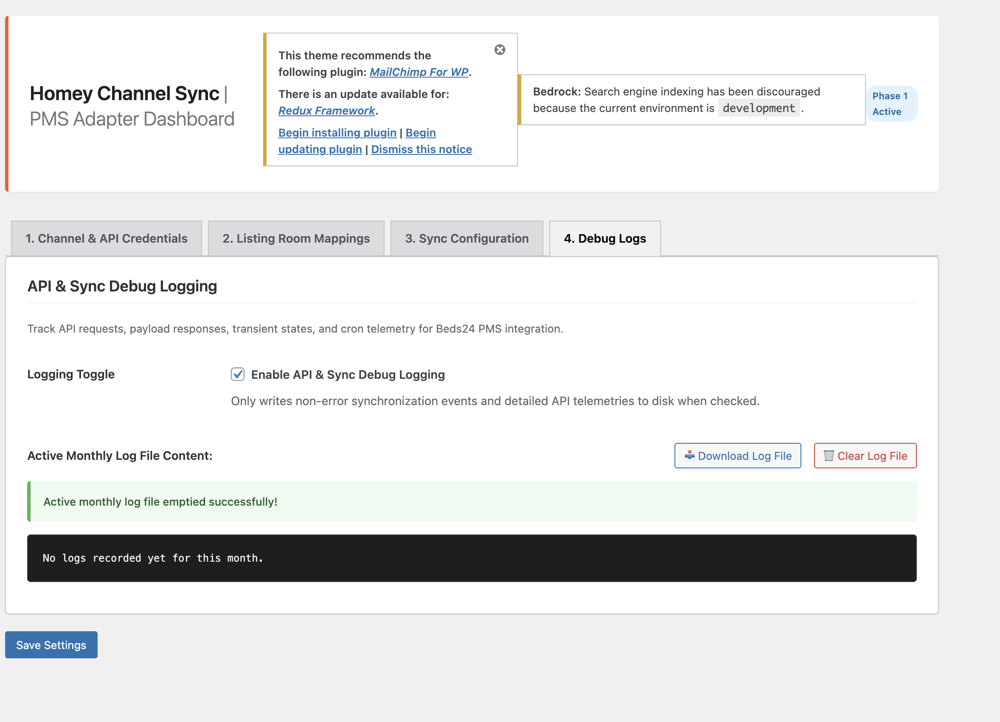

# Channel Sync for Homey

[](https://github.com/ejames17/channel-sync-for-homey/actions/workflows/ci.yml?query=branch%3Amaster)
[](https://github.com/ejames17/channel-sync-for-homey/actions/workflows/ci.yml?query=branch%3Adevelopment)
[](https://github.com/ejames17/channel-sync-for-homey/releases)
[](https://github.com/ejames17/channel-sync-for-homey)

Seamless channel management, dynamic pricing, and reservation sync engine connecting Beds24 and PMS channels to the Homey WordPress Theme.

**Homey Channel Sync** connects the [Homey Booking WordPress Theme](https://themeforest.net/item/homey-booking-wordpress-theme/23338013) with Property Management Systems (PMS) like Beds24 to enable automated dynamic daily pricing, rate syncs, and real-time reservation management.

Have a bug to report or a feature request? Please submit it to our [Public Bug & Feature Tracker](https://github.com/ejames17/channel-sync-for-homey/issues).

---

## 🗳️ Community Voting & Premium Roadmap

We are actively planning expansions! Support for other major Property Management Systems and other premium WordPress vacation booking themes will be coming soon as a **paid/premium upgrade**. 

Help shape our development by voting on what we build next:
* **🗳️ Vote for Next PMS/Channel Integration:** [Beds24, Guesty, OwnerRez, Hostaway, Cloudbeds Discussion](https://github.com/ejames17/channel-sync-for-homey/discussions/1)
* **🗳️ Vote for Next WordPress Booking Theme Support:** [Homey, RealHomes, Houzez, Traveler Discussion](https://github.com/ejames17/channel-sync-for-homey/discussions/2)

---

## 📸 Screenshots

### 1. Active Channel Selection & Secure Auth

*Seamlessly select your active PMS, exchange Invite Codes, and authorize using Beds24's secure REST v2 token handshake.*

### 2. Control Center Listing Mappings

*Map your published WordPress listings directly to external Property and Room IDs with automatic, real-time fuzzy name matching.*

### 3. Schedules, Feature Toggles & Overrides

*Configure custom WP-Cron background fetch schedules, activate dynamic price sync features, and run on-demand updates instantly.*

### 4. Interactive Front-End Overlays

*Renders dynamic pricing grids directly on listing calendars, adjusts widget headers based on selection, and overlays details breakdowns.*

---

## 🚀 Key Features

* **Beds24 V2 API Integration:** Robust connection utilizing Beds24's secure, modern REST V2 API with automatic self-healing token refresh sequences.
* **Fuzzy Autocompletion:** Instantly matches your WordPress Homey listings with external Beds24 properties and rooms.
* **Dynamic Header Pricing:** Shows a "From $XX" label based on your lowest/first available nightly rate on page load.
* **Date Range Recalculation:** Instantly displays the true average nightly rate inside the booking widget header as soon as dates are selected.
* **Transparent Breakdown Dropdowns:** Appends a slide-toggle daily pricing detail grid directly inside checkout summary panels.
* **Flexible Schedules:** Configure WP-Cron background fetch intervals (12 Hours, Daily, Weekly, Monthly) with a single click.
* **Manual Force Trigger:** Execute instant, real-time rate synchronizations on-demand with a visual ajax progress indicator.
* **Developer Friendly & Modular:** Extensible, driver-based adapter design ready for future channel managers and WordPress themes.

---

## 🛠️ Installation & Development

### Local Plugin Setup
1. Clone this repository into your WordPress local site's plugins directory:
   ```bash
   cd wp-content/plugins/
   git clone https://github.com/ejames17/channel-sync-for-homey.git
   ```
2. Activate the plugin via WordPress Admin dashboard.
3. Configure credentials under **Homey > Channel Sync** in your sidebar.

### Running End-to-End Tests
To guarantee the structural integrity of your changes, we use a robust Playwright-based testing suite that runs on real WordPress environments:
1. Install development dependencies:
   ```bash
   npm install
   ```
2. Run mock API and automated E2E tests:
   ```bash
   npx playwright test
   ```

---

## 🤝 Contributing & Support

We welcome contributions of any size! For bugs or feature requests, please open a GitHub Issue or utilize `/bug` commands inside the CLI.

---

## 📄 License
This project is licensed under **GPLv2 or later** (compatible with the WordPress Core License model).